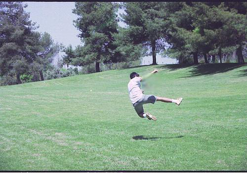

## Counterfactual VQA Dataset

### Introduction

This dataset provides 484 GAN edited [COCO val2014](https://cocodataset.org/) images for studing the interpretability of [Visual Question Answering](https://visualqa.org/) models. For each image, a human annotator looks at the original image and a natural language question about the image from the [Visual Question Answering](https://visualqa.org/) (VQA) dataset, and edit the image such that consistently answering the question on the original and edited images is challenging. 

Question: What sport is shown?

Counterfactual | Original
------------ | -------------
|

In this dataset there are 4 types of image edits:
1) Inpaint a box region,
2) Inpaint the background except a box foreground,
3) Turning the image black-and-white,
4) Zooming into a part of the original image.

For inpainting we used a modified DeepFillv2 ([Arxiv](http://arxiv.org/abs/1806.03589)) inpainter, available at https://github.com/zzzace2000/generative_inpainting.

### Images

We provide the GAN edited images and the original COCO images in `./counterfactual/{id}.png` and `./original/{id}.png`. The mapping between image id in our dataset and coco id is available in annotations.

### Annotations

We provide the urls to the original coco images, the original VQA question, as well as image editing annotations in `annotations.json`. At the moment we do not have VQA answers on the edited images so they are not useful for evaluating the consistency of VQA models. Nevertheless they may help as visualizations to explain a VQA model's performance in consistency to a human user.
